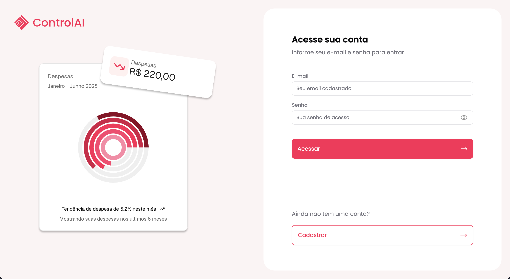

# 🔴 Gestão de Custos Domésticos - Front-end

Este é o front-end da aplicação **Gestão de Custos Domésticos**, desenvolvido em **Vite + React**.
---



## 📂 Estrutura do Projeto

- **Vite + React**
- **React Router DOM** → Controle de rotas
- **Axios/Fetch** → Comunicação com a API
- **React Query (TanStack Query)** → Cache e gerenciamento de dados assíncronos
- **Context API / Hooks** → Estado global simples
- **ShadCN + TailwindCSS** → Estilização e UI
- **Navegação SPA** → Redireciona para `/sign-in` se não houver token

## ⚙️ Decisões Técnicas

- Vite → build mais rápido
- React Query → gerenciamento inteligente de dados assíncronos
- Token JWT em cookies → autenticação simples para o desafio

## 🚀 Deploy
- Front-end: Vercel **https://controlai-frontend.vercel.app/sign-in**
- Back-end: Render **https://controlai-backend.onrender.com**

## 🎥 Vídeo de demonstração
- **https://www.youtube.com/watch?v=666BvUJS5Rc**

## 📚 Documentação
- **https://controlai-backend.onrender.com/docs**

---

## ▶️ Como executar localmente

```bash
# 1. Clonar o repositório
git clone <url-do-repositorio-front>

# 3. Instalar dependências
# 4. node 22 recomendado
npm install
```

## ▶️ Variáveis de Ambiente

```bash
# Crie um .env
VITE_API_URL=http://localhost:3333
VITE_ENABLE_API_DELAY=true
```

## ▶️ Executar o projeto

```bash
npm run dev
```
